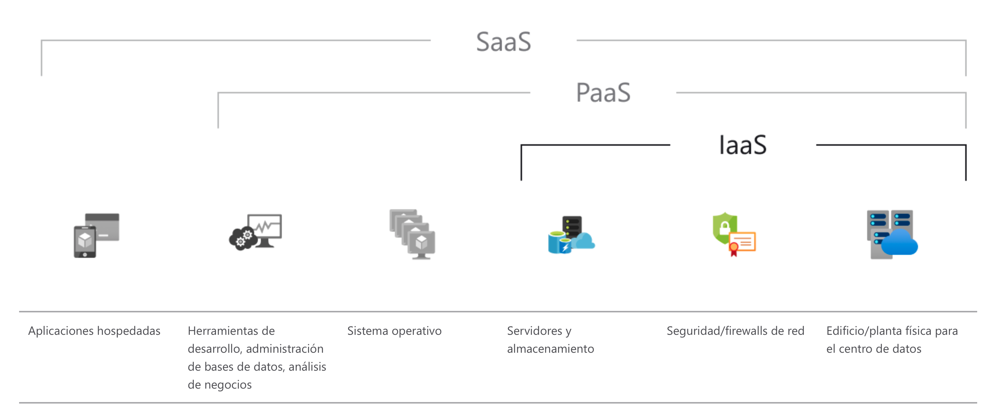

# Cloud Computing

Cloud computing, a menudo denominado simplemente "cloud”, consiste en ofrecer recursos informáticos a petición a través de internet, incluyen desde aplicaciones hasta máquinas en un CPD, utilizando un modelo de pago por uso, ya sea por horas de uso o por consumición de cierto recurso (Ej. Horas de una instancia o número de peticiones a través de un balanceador).

## IaaS

IaaS o Infraestructura como servicio, proporciona recursos informáticos de bajo nivel. Incluye servidores, redes, almacenamiento en bloques, GPUs...

### Ventajas

* No es necesario la posesión o inversión en hardware
* Se puede escalar la infraestructura a medida que la carga del servicio aumenta
* Ahorro de toda la lógistica y servicios asociados a la posesión de un CPD (Vigilancia, Seguros, SAIs...)
* A menudo los IaaS cuentan con disponibilidad en varias regiones, o en distintos CPDs dentro de una misma región

Ejemplo de IaaS: https://aws.amazon.com/es/

## PaaS

La plataforma como servicio proporciona un entorno basado en cloud con todos los requisitos necesarios para dar soporte a todo el ciclo de vida de creación y puesta en marcha de aplicaciones basadas servicios web, sin el coste y la complejidad de comprar y gestionar el hardware, software, aprovisionamiento y alojamiento necesario.

### Ventajas
* Permite acelerar el desarrollo y la comercialización de aplicaciones
* Permite Desplegar en cuestión de minutos nuevas aplicaciones web en cloud
* No es necesario conocimientos a nivel de Hardware

A menudo es más caro que un despliegue equivalente en un IaaS.

Ejemplo de PaaS: https://www.heroku.com

## SaaS

El software como servicio (SaaS) permite a los usuarios conectarse a aplicaciones basadas en la nube a través de Internet y usarlas. Algunos ejemplos comunes son el correo electrónico

SaaS ofrece una solución de software integral que se adquiere de un proveedor de servicios en la nube mediante un modelo de pago por uso. Toda la infraestructura subyacente, el middleware, el software y los datos de las aplicaciones se encuentran en el centro de datos del proveedor. El proveedor de servicios administra el hardware y el software y, con el contrato de servicio adecuado (SLA), garantizará también la disponibilidad y la seguridad de la aplicación y de sus datos.

### Ventajas

* Plug & Play. Te registras y empiezas a usar la aplicación
* Las aplicaciones y los datos son accesibles desde cualquier sistema conectado a internet
* A menudo disponen de SLAs con una dispobilidad de datos muy alta, por lo que la falta de servicio o la indisponibilidad de los datos es algo casi imposible de que ocurra
* El servicio permite escalar en función del uso. La gestión del escalado la realiza el proveedor
* Las operaciones las gestiona el proveedor (mantenimiento, soporte...)

## Modelos de implementación

### 100% Cloud

Una aplicación basada en la nube se encuentra implementada totalmente en la nube, de modo que todas las partes de la aplicación se ejecutan en esta. Las aplicaciones en la nube se han creado directamente en la nube o se han transferido de la infraestructura existente para aprovechar los beneficios de la informática en la nube. Las aplicaciones basadas en la nube se pueden construir en partes de infraestructura de bajo nivel o pueden utilizar servicios de nivel superior que proporcionan abstracción de los requisitos de administración, arquitectura y escalado de la infraestructura principal. Por ejemplo, se pueden desplegar conetenedores Docker sobre instancias, de modo que esos contenedores utilicen las bases de datos gestionadas por el proveedor de cloud (en el caso de AWS el servicio de base de datos se denomina RDS).

### Modelo Híbrido

Una implementación híbrida es una manera de conectar la infraestructura y las aplicaciones entre los recursos basados en la nube y los recursos existentes situados fuera de la nube. El método más común de implementación híbrida consiste en conectar la nube y la infraestructura existente en las instalaciones para ampliar e incrementar la infraestructura de la organización en la nube al mismo tiempo que se conectan estos recursos en la nube con el sistema interno.

### CPD Propio o Nube Privada

La implementación local de recursos mediante herramientas de administración de recursos y virtualización se denomina a veces "nube privada". La implementación local no aporta muchos de los beneficios de la informática en la nube, pero a veces se utiliza por su capacidad de ofrecer recursos dedicados a cada equipo o producto de la organización. Uno de los productos Open Source más utilizados para crear nubes privadas es [Open Stack](https://www.openstack.org). La nube privada es una buena forma de modernizar la asignación de recursos cuando ya se dispone de Hardware.

## Enlaces de interés

* https://aws.amazon.com/es/what-is-cloud-computing/?pg=TOCC
* https://aws.amazon.com/es/types-of-cloud-computing/
* https://www.ibm.com/es-es/cloud/learn/cloud-computing-gbl
