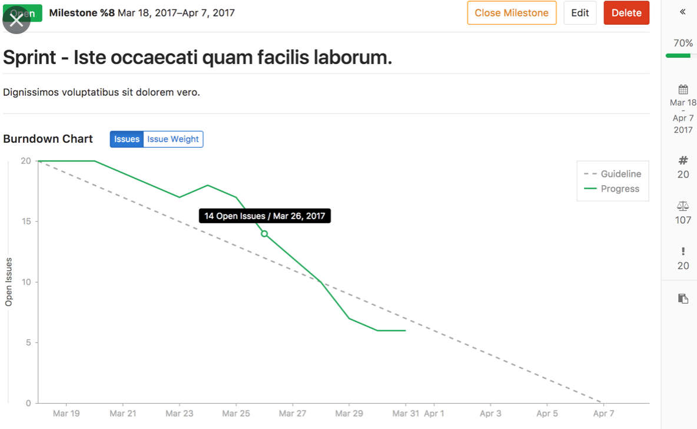
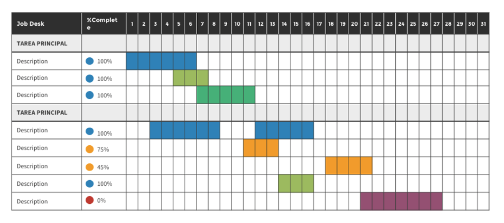

# Herramientas para la Gestión de Proyectos y Gestión de La configuración

## Artefactos de la gestión de Proyectos

Una vez decidido el sistema para gestionar un proyecto, es necesario conocer los
artefactos que nos van a ayudar a realizar la gestión del proyecto, y posteriormente evaluar el estado del mismo.

Una vez decididos los artefactos con los que queremos trabajar, es necesario disponer de las herramientas que nos permitan disponer de estos artefactos.

Una práctica habitual general es disponer de una herramienta en la que se puedan incluir *tareas* o *historas de usuario*, y asignarlas a un miembro del equipo, que pasará a ser el responsable de realizar o hacer que se realice esa tarea.

En *Scrum* estas tareas se organizan en objetivos tácticos o estrátegicos denominados *épicas*. El conjunto de épicas y tareas que no se están realizando en un Sprint se denomina *backlog* y es responsabilidad del *Product Owner* priorizar ese *backlog*, no obstante es responsabilidad de todo el equipo que las historias estén debidamente actualizadas, con las descripciones oportunas, y sus estimaciones.
También es responsabilidad de los miembros del equipo llevar la contabilidad del tiempo dedicado a cada una de las *historias de usuario*

En *Kanban* por ejemplo el backlog solo consiste en tareas que se priorizan, no obstante se pueden tener etiquetas dependiendo del ámbito.

En *Scrum* una de las métricas más importantes es el *Burndown Chart* o gráfico de velocidad,
que indica la cantidad de puntos de historia que es capaz de realizar un equipo
*Scrum* por *Sprint*, y cómo esa velocidad cambia a lo largo del tiempo.

En waterfall los artefactos más habituales para conocer los estados de los proyectos son los diagramas de Gantt o Cronogramas.

Lo ideal es que la herramienta elegida sea común para toda una organización y se adapte a todas estas necesidades.  

## Gestión de la configuración y Control de Versiones

La gestión de la configuración es el conjunto de procesos destinados a asegurar la calidad de todo producto obtenido durante cualquiera de las etapas del desarrollo de un sistema de información, a través del estricto control de los cambios realizados sobre los mismos y de la disponibilidad constante de una versión estable de cada elemento para toda persona involucrada en el citado desarrollo.

Estos dos elementos, el control de cambios y control de versiones de todos los elementos del SI, facilitan también el mantenimiento de los sistemas al proporcionar una imagen detallada del sistema en cada etapa del desarrollo. La gestión de la configuración se realiza durante todas las fases del desarrollo de un sistema de información, incluyendo el mantenimiento y control de cambios, una vez realizada la puesta en producción.

Ejemplos de configuración de software:

* Ejecutables/ artefactos
* Código Fuente
* Modelos de datos
* Modelos de procesos
* Especificaciones de requisitos
* Pruebas
[De Wikipedia](https://es.wikipedia.org/wiki/Gestión_de_la_configuración)

## Herramientas sugeridas

* Github
* Gitlab
* Microsoft teams
* Jira
* Trello
* Gsuite
* Excel o similares
* ClickUp
* Asana
* OpenProject
* ProjectLibre
* Zentao

### Qué tener en cuenta a la hora de elegir

* Precio
* Disponibilidad
* Esfuerzo de instalación/registro
* Curva de aprendizaje
* Funcionalidades que incluyen
* SaaS VS On-premise

**Ejercicio por grupos**

> Pensar en los artefactos necesarios para la gestión del proyecto. Este ejercicio
está incluido en la primera entrega. [RFI I](RFI/RFI-I.md). Es necesario documenta la decisión en un [ADR](ADR/README.md) o similar.

> Decidid las herramientas necesarias para la gestión del proyecto. Este ejercicio
está incluido en la primera entrega. [RFI I](RFI/RFI-I.md). Es necesario documenta la decisión en un [ADR](ADR/README.md) o similar.

>**Cada equipo deberá demostrar que ha utilizado la herramienta elegida a lo largo
del desarrollo del proyecto.**
