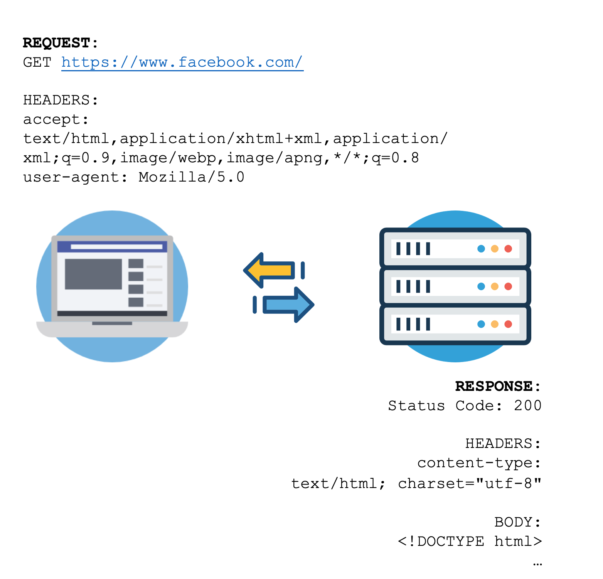
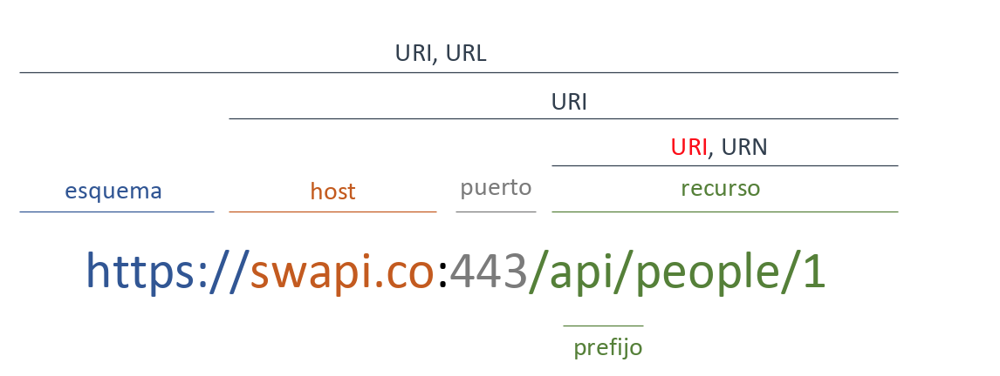
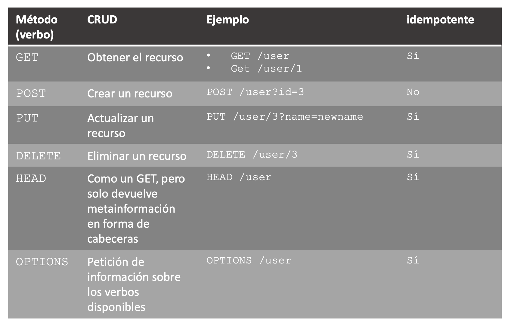
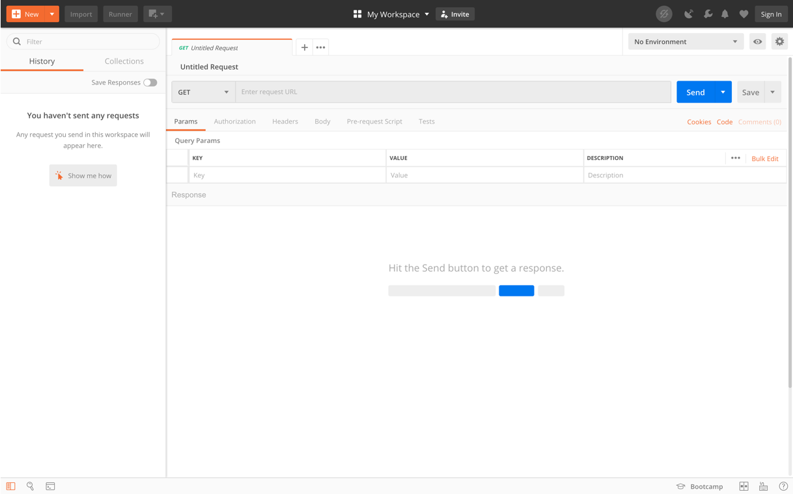

# Introducción a las APIs

> curl -XGET https://quotes.rest/qod | jq -r .contents.quotes[0].quote

## Índice de Contenido

* [Introducción](#introducción)
* [API](#api)
* [Tipos de arquitecturas de APIs](#reutilización-de-clases-y-métodos)
* [REST](#rest)
* [Desarrollando una API con Python y Flask](#desarrollando-una-api-con-python-y-flask)
* [Postman](#postman)
* [Ejercicios](#ejercicios)

## Objetivos

* Conocer formas de comunicación con servicios *backend*
* Aprender los principios básicos de `REST`
* Desarrollar una pequeña API con Python
* Aprender a probar APIs/URLs HTTP con Postman

## API

*Application Program interface*. Es una interfaz de comunicación a un componente de software (una serie de funciones por ejemplo) que define como se debe usar ese componente. De forma más práctica podemos verlo como una serie de métodos de un programa pensados para ser ejecutados desde otro programa.

A menudo las APIs se refieren por lo general A Web APIs, que permiten la comunicación con servicios web a través del protocolo `HTTP`, `HTTPS` (para conexiones seguras) .

En esta asignatura con el término API, nos estaremos refiriendo a Web APIs. Las Web APIs, siguiendo una estructura básica de cliente servidor, se encuentran en la parte servidora, de forma que el código cliente (*frontend* si se ejecuta en un terminal de usuario o *middleware* si se ejecuta en un servidor *on-premise* de un cliente) va a poder llamar a métodos del servidor.

Vamos a usar los verbos de HTTP (GET, POST, PUT, DELETE, PATCH, -) para usar CRUD (OBTENER, CREAR, ACTUALIZAR, BORRAR , - , -), para el publicador y para el consumidor.

Es necesario versionar la api "http://algunaapi/api/v2" la ultima parte se encarga el servicio *añadir servicio*.

Crear un objeto conductor {"id" : "Pablo", "apellido": "Cabras"} formato JSON por ejemplo. "Añadir errores de HTTP: 200(control),400(peticion),500(Servidor)"

Si queremos hacer un PUT es necesario incluir la id para saber que recurso estamos actualizando.

A diferencia del modelo tradicional de programación web (por ejemplo en `PHP`), que ejecuta el código y renderiza las vistas en la parte servidora, mediante el uso de Web APIs se puede separar totalmente la ejecución y renderización de la vista (código *frontend*) respecto al código de servidor. Para ello se utilizan distintas estructuras de datos (`JSON`, `XML`...) para transmitir la información necesaria sobre el protocolo `HTTP`.

Esto mismo se puede trasladar al paso de información de tipo *M2M* o *Machine to Machine* que haría referencia a la transmisión de información de un servidor a otro.

Al igual que como ocurre con `PHP`, las APIs necesitan un servidor para ser expuestas y poder ser llamadas. Uno de los servidores más habituales en Python es Gunicorn (https://gunicorn.org).

## Tipos de arquitecturas de APIs

### SOAP

* Requiere el uso de una librería SOAP
* No soportado por todos los lenguajes
* Expone llamadas a métodos
* Requiere el uso de XML
* Todas las llamadas se realizan mediante el método POST de `HTTP`
* Puede ser con estado (stateful) o sin estado (stateless)
* Muy difícil de usar por los desarrolladores

### RPC

* Altamente acoplado
* Puede devolver cualquier formato
* Requiere que el cliente conozca los nombres de los procedimientos
* Requiere parámetros y orden específicos
* Requiere una URI diferente por cada método
* Típicamente utiliza `GET` y `POST`
* Requiere una extensiva documentación
* Sin estado
* Fácil de empezar a usarse por los desarrolladores

### REST

* No necesita librerías, utiliza `HTTP`
* Devuelve datos, sin exponer métodos
* Soporta cualquier tipo de `Content-Type`, `JSON` es el más usado
* Permites múltiples acciones por recurso
* Utiliza los verbos `HTTP`
* Sin estado
* Algo más difícil de usar por los desarrolladores
* La más común


### Ejemplos de APIs públicas en internet

* The Star Wars API: https://swapi.co
* Pokemon API: https://pokeapi.co
* Twitter API: https://developer.twitter.com/en/docs

## REST

REpresentational State Transfer

Es un tipo de arquitectura de software, pensado para aplicaciones que se comunican a través de la red e introducida por primera vez por Roy Fielding en su tesis: *Architectural Styles and the Design of Network-based Software Architectures*

Toda la comunicación está basado en el protocolo HTTP.

### Repaso HTTP

#### Características:

* `HTTP`: Hyper Text Transfer Protocol
* Protocolo de la capa de aplicación
* Pensado para comunicación cliente – servidor
* Es un protocolo sin estado (el servidor no guarda información de los clientes)



#### Elementos de HTTP:

* Verbos:
  * `GET`
  * `POST`
  * `PUT`
  * `DELETE`
  * ...
* Enlaces a recursos
  * Ejemplo: https://www.facebook.com/user
* Cabeceras: Permiten enviar informaicón adicional sobre la petición/respuesta
  * Ejemplo: `'Content-type: application/json'`
* Cuerpo de la petición
* Códigos de error
  * `500`+: Error en el servidor
  * `400`-`499`: Error en la petición
  * `300`-`399`: Códigos de redirección
  * `200`-`299`: Códigos de éxito

### Recursos REST

Las APIs `REST` definen recursos, los cuales son accesibles mediante las URIs



En la imagen anterior la URI es `/api/people/1` y el recurso es `people` o personas, de forma que el número `1` es el identificador de la persona.

### CRUD en REST

En la tabla se puede observar como se utilizan los verbos HTTP para realizar operaciones de tipo CRUD sobre el recurso `user`



### Cuerpo de las peticiones/respuestas en REST

Lo más habitual es que las APIs soporten distintos métodos de comunicación como por ejemplo:
* `application/xml`
* `application/json`

Por su sencillez, y por que es lo más común nosotros vamos a trabajar con objetos `JSON`.

Ejemplo:

```JSON
{
  "users": [
    {
      "id": 1,
      "name": "Luke Skywalker"
    },
    {
      "id": 2,
      "name": "Han Solo"
    }
  ]
}
```

### Ventajas de las APIs REST

* La separación entre el cliente y servidor hace que las aplicaciones sean más escalables y fáciles de desplegar
* Independientes de la plataforma o el lenguaje
* Perfecto para aplicaciones que se comunican entre ellas
* Fácil de integrar en contenedores como Docker o LXC

## Desarrollando una API con Python y Flask


### Flask (servicio extra que hace de interfaz con nuestro replicador)

Flask es un Framework de Python con el que se pueden crear APIs de una forma rápida y sencilla.

Sitio Oficial y documentación: https://flask.palletsprojects.com/en/1.1.x/

#### Características:

* Python
* Framework ligero
* Fácil de utilizar
* Incorpora un servidor para pruebas (no recomendado para producción)
* Open Source
* Github: https://github.com/pallets/flask
* Página oficial: https://flask.palletsprojects.com/en/1.1.x/

#### Instalación

```shell
$ sudo apt install python-pip
$ sudo pip install Flask
```

### Creación de un endpoint

*`app.py`*
```python
from flask import Flask  
app = Flask(__name__)

@app.route('/')
def index():
    return 'Hello World!'
```

Ejecución:

Para lanzar la aplicacion, desde la carpeta donde se encuentra `app.py`:
```shell
$ FLASK_APP=app.py flask run
 * Running on http://localhost:5000/
```

En otra terminal
```shell
curl http://localhost:5000
```

De la misma forma en el navegador puedes acceder a:
`http://localhost:5000`

### Añadir más endpoints

*`app.py`*
```python
from flask import Flask
from flask import Response
import json

app = Flask(__name__)

@app.route('/user', methods=['GET'])
def get_users():
  all_users = _get_all_users()
  return (Response(json.dumps(all_users), status=200,
  mimetype='application/json'))

@app.route('/user/<name>', methods=['GET'])
def get_user_by_name(name):
  user = _get_user_by_name(name)
  return (Response(json.dumps(user), status=200,
  mimetype='application/json'))

@app.route('/user', methods=[‘POST’])
def create_user():
  if request.is_json:
    data = request.get_json()
    print(data)
    # creo el usuario nuevo con data
    # ...
    return (Response(status=200, mimetype='application/json'))
  else:
    return (Response(status=403, mimetype='application/json’))
```

Para probar la api desde la terminal se puede utilizar el programa `curl`

```shell
# Para hacer un GET
$ curl –XGET https://localhost:5000/user

# Ejemplo de POST contra httpbin
$ curl -X POST -d '{ "user": "prueba"}' "https://localhost:5000/user" -H "accept: application/json"

```

Existen servicios online como HTTPBin https://httpbin.org muy útiles para pruebas.

## Postman (suite para trabajar con apis)

Postman es la herramienta gráfica definitiva para trabajar con APIs. Puedes obtenerlo en el siguiente enlace. https://www.getpostman.com/downloads

### Características:

* Gestión de peticiones (*Requests*)
* Colecciones de peticiones
  * Ejecución periódica
  * Mocks
* Entornos
* Workspaces colaborativos
  * Personal
  * Team
  * Private
* Variables para colecciones/entornos
* Import / Export de colecciones
* Permite guardar las peticiones también entre diferentes lenguajes
* Captura de Peticiones
* Historial de actividad



### Enlaces útiles de la documentación (hay que implementar una api por delante del replicador)

La documentación de Postman es muy ampllia y está muy bien desarrollada. Se puede aprender mucho sobre como funciona HTTP siguiendo esta documentación.

Enlace a la documentación: https://learning.postman.com/docs/postman/sending-api-requests/requests/

**Ejercicios Opcionales**

> 1. Instalación de las herramientas Flask y Postman (y curl de forma optativa)

> 2. Creación de una API en Python con Flask que gestione usuarios y películas (CRUD)
* No es necesario utilizar una base de datos. Con el uso de diccionarios y listas de Python es suficiente para guardar datos.
* La API debe cumplir los principios `REST` mencionados anteriormente
* Un usuario activo puede alquilar películas, desde la API es importante poder ver las películas que tiene alquiladas en el momento actual como las películas que ha alquilado en el pasado.
* Un usuario suspendido no puede alquilar películas. Pero sí se debe poder consultar su estado

> 3. Repasa la documentación básica de Postman.
https://learning.postman.com/docs/postman/launching-postman/sending-the-first-request/

> 4. Crear una colección de peticiones/*requests* en Postman con los test apropiados de forma que comprueben que la API funciona correctamente. Es recomendable generar una colección con todas las peticiones (cada una debe tener el test apropiado en la pestaña test) para luego usar el *Runner*

#### Ejemplo de test:

```
pm.test("Status code is 200", function () {
    pm.response.to.have.status(200);
});
```

#### Enlaces útiles para la realización de tests:

* Introducción a los scripts en Postman: https://learning.getpostman.com/docs/postman/scripts/intro_to_scripts/
* Postman Sandbox: https://learning.getpostman.com/docs/postman/scripts/postman_sandbox/
* Postman Sandbox API: https://learning.getpostman.com/docs/postman/scripts/postman_sandbox_api_reference/

**Ejercicio**

> Implementar una API REST para que un cliente externo a nuestro SaaS pueda comunicarse con el replicador.
> (no es necesario)MULTITENANT (separar la BBDD en varios eschemas) Transformar peticiones
> Para diferenciar los clientes es necesario autenticarlos
> Es necesario autorizar el acceso a distintos clientes 
> LOG a nivel de acceso y LOGS de lo que hace cada servicio. LOGS de negocio(metricas del sistema) o LOGS de operativa(nº peticiones)
> Triple A: Autenticacion, autorizacion, y Auditoria.(necesario incluir en el RFI II)
> Homogenizar los endpoints(versionarlos tambien). Cosas similares para los usuarios finales.
> 
Ademas de la api añadir una api gateway(no tiene interfaz, solucion open source KONGA-CONGA-KONG?)
Autenticacion, autorizacion y Auditoria. Dockerlogs id contenedor
Todo se guardara en una base de datos Posgress(fichero definicion)
Recomendacion: Usar Docker, Y Docker para la base de datos.

**Organizacion sugerida:**
Definicion API
KONG y BBDD y explicacion
Se monta la api al replicador
Se activa pluggin de authenticaicon
Se activa plugin de los logs

Semana que viene una demo de KONG en sistema local.
