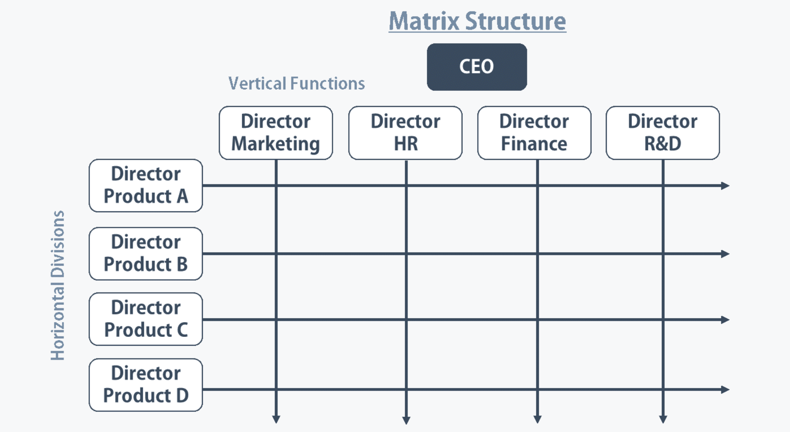

# Modelos de Dirección, Modelos de Gestión y Roles en las Organizaciones

Para poder gestionar correctamente la tecnología en una organización, primero
es necesario comprender la estructura de ésta. Conocer la estructura nos dará las
primeras claves para saber la tecnología necesaria en cada ámbito y como desplegarla
o aplicarla.

Preferiblemente, las tecnologías informáticas, deberían ser transversales a toda la
organización, aunque a menudo esto no es posible, por la distancia, por los distintos requerimientos
de cada departamento, equipo, o porque simplemente algún mando intermedio no quiere
dejar su forma de trabajar por la que se propone para toda la organización.

## Estructura de las Organizaciones

Existen cuatro tipos de estructuras fundamentales:

#### Funcional

Las personas se agrupan según el ámbito del trabajo que realizan, por ejemplo
en departamentos de contabilidad, IT, o tecnología.

#### En divisiones

La organización se divide en suborganziaciones autocontenidas, por ejemplo una empresa
puede tener divisiones en USA y Europa, cada una de ellas con su equipo de dirección,
departamentos de IT, contabilidad.

#### Matricial

Es una combinación de las dos anteriores. Un ejemplo podría ser una empresa automotriz,
donde cada planta tiene su jefe de planta, pero en Alemania (un lugar centralizado
  para todas las plantas) se encuentran los directores de cada departamento,
  Producto, financiero...

#### Híbrida

Es una combinación de la funcional con la matricial.

## Roles tecnológicos en las organizaciones

Habitualmente la dirección está formada por los siguientes cargos:
* CEO (Chief Executive Officer)  
* CFO (Chief Financial Officer)
* COO (Chief Operating Officer)

Las tecnologías informáticas y tecnologías de software cada vez tienen un papel
más importante en las organizaciones, de forma que se han creado puestos específicos
para estos ámbitos en lo más alto de la dirección.

* CTO (Chief Technology Officer) en un rol similar al CIO pero más técnico. En este sentido, se han identificado nada menos que seis roles distintos que pueden desempeñar los CTO. Se entremezclan con las funciones de los CIO. Sin embargo podemos decir que es un director técnico, siendo su responsabilidad la gestión del día a día de las tecnologías de la información.
* CIO (Chief Information Officer) es el gerente de sistemas o director de tecnologías de la información. Reporta directamente al CEO, y se encarga básicamente de que las estrategias de la organización estén alineadas con la tecnología de la información para lograr los objetivos planificados. Además, se encarga de mejorar los procesos de tecnologías de la información de la organización, gestionar el riesgo y la continuidad de negocio, controlar el coste en infraestructura de tecnologías de la información, alinear el gobierno de tecnologías de la información a los requerimientos tecnológicos, y establecer mejoras e innovaciones de soluciones y productos.

También se han creado puestos relacionados con la ciberseguridad.

* CISO (Chief Information Security Officer) es el director de seguridad de la información. Básicamente es un rol desempeñado a nivel ejecutivo y su función principal es la de alinear la seguridad de la información con los objetivos de negocio. De esta forma se garantiza en todo momento que la información de la empresa está protegida adecuadamente. Sus responsabilidades incluyen:
  * Generar e implantar políticas de seguridad de la información.
  * Garantizar la seguridad y privacidad de los datos.
  * Supervisar la administración del control de acceso a la información.
  * Supervisar el cumplimiento normativo de la seguridad de la información.
  * Responsable del equipo de respuesta ante incidentes de seguridad de la información de la organización.
  * Supervisar la arquitectura de seguridad de la información de la empresa.
* CSO (Chief Security Officer) es el responsable de la seguridad de la organización. Al CSO a veces se le denomina responsable de seguridad corporativa. Podemos pensar que el CISO y el CSO son el mismo rol y que desempeñan las mismas funciones. En organizaciones pequeñas es frecuente que coincidan ambas responsabilidades en una misma persona. Pero realmente no es así. El rol del CISO suele estar más centrado en aspectos de seguridad de la información, mientras que al CSO se le requiere:
  * Tener una visión de negocio que comprenda los riesgos que afronta la organización y cómo tratarlos.
  * Entender la misión y los objetivos de la empresa y asegurarse de que todas las actividades son planificadas y ejecutadas para satisfacer dichos objetivos.
  * Comprender las necesidades normativas, la gestión de la reputación de la organización y las expectativas de los usuarios.
  * Establecer los planes de continuidad de negocio y recuperación de desastres en el ámbito de las tecnologías de la información.
  * Estar al tanto de los cambios normativos, debiendo informarse de las consecuencias para las actividades de la organización y proponiendo las medidas oportunas para adecuarse al nuevo marco normativo.
  Cuando existen CSO y CISO, el CISO reporta al CSO y el CSO a la dirección.

*Información obtenida de: [Incibe](https://www.incibe.es/protege-tu-empresa/blog/ceo-ciso-cio-roles-ciberseguridad)*

Como empresa real tenemos un ejemplo en [Apple](https://www.apple.com/leadership/) teniendo representantes del Software en lo más alto de la cadena
de dirección

En definitiva, una empresa funcionará bien si cada empleado está alineado con las
ideas de la dirección, representadas por los roles anteriores. Esto es responsabilidad de cada jefe y mando intermedio.

>**En nuestro proyecto el jefe de equipo será el responsable de coordinar y guiar
a los miembros del equipo en la misma dirección, para cumplir los objetivos que
se vayan planteando**

## Objetivos, Tareas y Funciones

**Ejercicios cooperativos**

> ¿Qué es un objetivo?

> ¿Qué son tareas y funciones?

> ¿Cuáles son las labores de un jefe de equipo?

## Modelos de dirección  

Los jefes tienen poder sobre los miembros del equipo. Son los responsables, y son los que
deben asegurarse de llegar a los objetivos impuestos por la dirección.

>**En nuestro proyecto, los objetivos estarán representados por una empresa externa
que desea comprar nuestra tecnología**

Las labores de un jefe son:
* Coordinar
* Gestionar
* Reportar
* Controlar
* Motivar

En definitiva, dirigir para llegar a cumplir los objetivos establecidos

Las labores de un empleado son:
* Realizar sus tareas y funciones (trabajar)
* Cumplir las normas establecidas

>**En nuestro proyecto, debido a ser equipos pequeños, los jefes tendrán además
de la función de dirigir, la función de trabajar**

Tipos de dirección:
* Autoritaria
* Informativa
* Consultiva
* Participativa

**Ejercicios cooperativos**

> Discutid sobre las distintas formas de dirección y exponer la forma elegida
en cada equipo

> Elegid el jefe en cada equipo. ¿Por qué esa persona?

## Gestión de Proyectos

* La gestión de proyectos es crucial en la consecución de objetivos y el seguimiento de los planes y expectativas.
* Es frecuente ver que se depositan grandes esperanzas y expectativas en los proyectos, y que los miembros del equipo colaboran activamente, pero aún así no todo termina siempre como se había previsto.
* Se precisan modelos de gestión de proyectos y procesos que permitan a los gestores de proyectos planificar y alcanzar las metas de cada proyecto.

Es necesario decidir cuál es el modelo de gestión de proyectos para cada equipo/proyecto. Las herramientas tecnológicas
corporativas deberán permitir cierta flexibilidad para adaptarse a distintos tipos de proyectos.

### Modelos de Gestión

Los más conocidos/utilizados en empresas tecnológicas son los siguientes:
* Tradicional
* Waterfall o Desarrollo en cascada
* Agile
  * Kanban
  * Scrum
* Lean
* RUP
* CMMI

#### Tradicional
*Autor: José Javier Astráin Escola*

Consiste en dividir el proyecto en diferentes procesos que se ejecutan de forma secuencial. Típico del ámbito industrial

Procesos:
* Inicialización: definición inicial del proyecto y fases, junto con la aprobación de su inicio.
* Planificación: desarrollo de los diferentes planes de gestión.
* Ejecución: realización de las tareas planificadas en la fase anterior con objeto de completar los entregables.
* Seguimiento y control: supervisión de las tareas ejecutadas, comparación con la planificación (líneas base), y definición y aplicación de correcciones en caso de desviaciones.
* Cierre: finalización de la fase o proyecto
  * por haber conseguido la aprobación del conjunto de entregables
  * por no ser posible conseguir alcanzar los entregables,
  * porque el proyecto ha dejado de tener motivo de ser.

Áreas de conocimiento ([PMI](https://www.pmi.org/pmbok-guide-standards))
* Integración: Incluye los procesos y actividades requeridos para identificar, definir,
combinar, unificar y coordinar los mismo a realizar por los grupos de trabajo.
* Alcance:  Incluye los procesos requeridos para asegurar la realización de todo el trabajo a aplicar en el proyecto, y no solo realizar aquellos que completen el proyecto.
* Tiempo: Incluye los procesos requeridos para la correcta administración de tiempo.
* Costes: Incluye los procesos involucrados en la planificación, estimación, presupuesto, financiamiento, costeo, administración y control de costos; con el objetivo de que el proyecto sea realizado con un presupuesto apropiado
* Calidad:  Incluye los procesos y actividades involucrado en el rendimiento de organización, que define la política de calidad, objetivos y responsabilidades para que el proyecto satisfaga las necesidades por las que se hizo
* Recursos Humanos
* Comunicación: Incluye los procesos requeridos para asegurar en tiempo y forma la planificación, recolección, creación, distribución, almacenaje, recuperación, administración, control, monitoreo y disposición de la información del proyecto.
* Riesgo: Incluye los procesos que planean, identifican, analizan, y controlan los posibles o actuales riesgos del proyecto.
* Adquisición: Incluye todos los procesos necesarios para la adquisición y compra de productos, bienes, servicios o resultados requeridos del exterior por el equipo de trabajo.
* Interesados: Incluye todos los procesos requeridos para identificar los grupos u organización que impacta el proyecto; analizando sus expectativas y desarrollar las estrategias necesarias para impactar positivamente en la ejecución y decisiones de los interesados.

Recurso interesante : [Guía PMBOK](https://uacm123.weebly.com/index.html)

#### Waterfall/Cascada

Está basado en el desarrollo secuencial de las siguientes fases:

1. Análisis de requisitos
1. Diseño
1. Implementación
1. Verificación
1. Mantenimiento

Es una metodología fácil de seguir y de llevar a cabo, no obstante, en proyectos de requisitos cambiantes es necesario
volver al diseño del proyecto por completo antes de avanzar, por lo que lo hace muy poco flexible.

Es necesario esperar a que el software esté terminado para probarlo, a menudo esto hace que se encuentren errores muy
difíciles de resolver que retrasan en gran medida los proyectos.

>**En nuestro proyecto puede que los requisitos sean cambiantes**

#### Agile

[Agile Manifesto](https://agilemanifesto.org)

El objetivo principal de las metodologías Ágiles consiste en ofrecer entregas
continuas con una parte de la funcionalidad.  

**Ejercicio**

> ¿Cómo construiríamos un coche usando una metodología Ágil? ¿Y una App de Android?

##### Scrum

Es un marco de trabajo para ayudar a los equipos a realizar un proyecto fe forma
ágil.

[Guía en Inglés](https://www.scrumguides.org/scrum-guide.html)

**Ejercicio por grupos**

> Sin mirar todavía la guía de Scrum. ¿Qué sabemos de Scrum?. Anotad los roles, eventos y artefactos que recordéis.

Scrum no es una metodología, es un marco de desarrollo. Pero habitualmente nos referimos a
Scrum de cualquiera de las dos maneras.

##### Kanban

Es un flujo de trabajo que sirve para maximizar la eficiencia en un contexto de numerosas interrupciones o cambios en los requisitos. Se integra muy fácilmente en organizaciones
que ya tienen otros flujos implementados.

###### Principios

1. Visualizar el flujo de trabajo mediante paneles o boards
2. Limitar el número de tareas que están en proceso
3. Se gestiona el trabajo no a las personas

**Ejercicio por grupos**

> Sin investigar ni mirar en internet, desarrollad un board de kanban

##### Lean

[Web Oficial](http://theleanstartup.com/principles)

Es una forma de trabajar pensada en salir al mercado lo más rápido posible. Para ello lo imprescindible es trabajar hacia el MVP o *Minimum Viable Product*. Está enfocado a los emprendedores o startups.
Es compatible con otras metodologías ágiles para la gestión del equipo de desarrollo. Es preferible que sean meotodologías ágiles, ya que de lo que una
startup tiene en mente como producto a lo que finalmente acaba llevando al mercado
puede haber grandes diferencias (o incluso ser productos de ámbitos totalmente distintos)

**Ejercicio por grupos**

> 5 Ventajas y desventajas de Agile

## Buenas Prácticas. CMMI, ITIL

#### CMMI (Capability Maturity Model Integration)

[Web Oficial](https://cmmiinstitute.com)

Es un modelo para la mejora y evaluación de procesos para el desarrollo, mantenimiento y operación de software.

[CMMI en Tutorialspoint](https://www.tutorialspoint.com/cmmi/cmmi_quick_guide.htm)

#### ITIL

Guía de buenas prácticas para empresas que proveen servicios de IT.

ITIL es un marco donde se proporcionan pautas de buenas prácticas en todos los aspectos de la gestión de servicios de un extremo a otro. Cubre un espectro completo de personas, procesos, productos y uso de partners.

Hoy en día, casi todas las empresas que ofrecen servicios de TI a sus clientes practican ITIL.

[Itil en Tutorialspoint](https://www.tutorialspoint.com/itil/index.htm)
